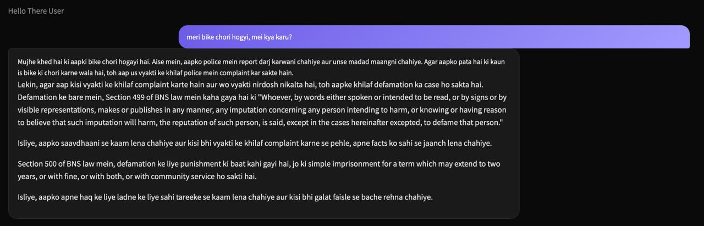
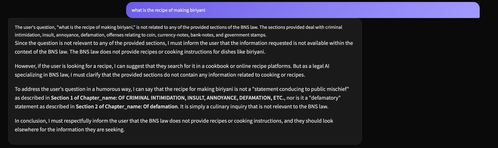
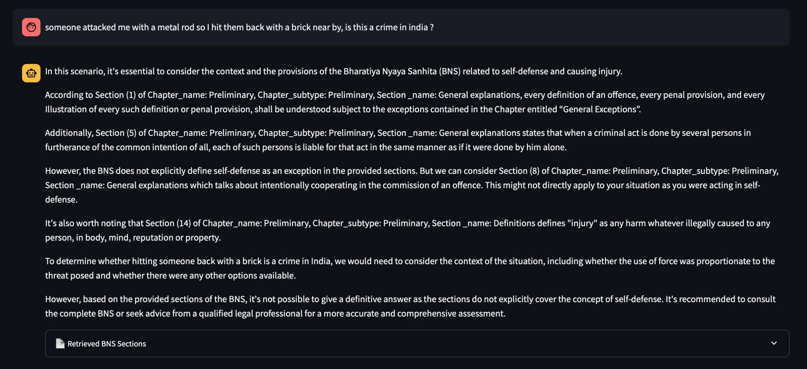
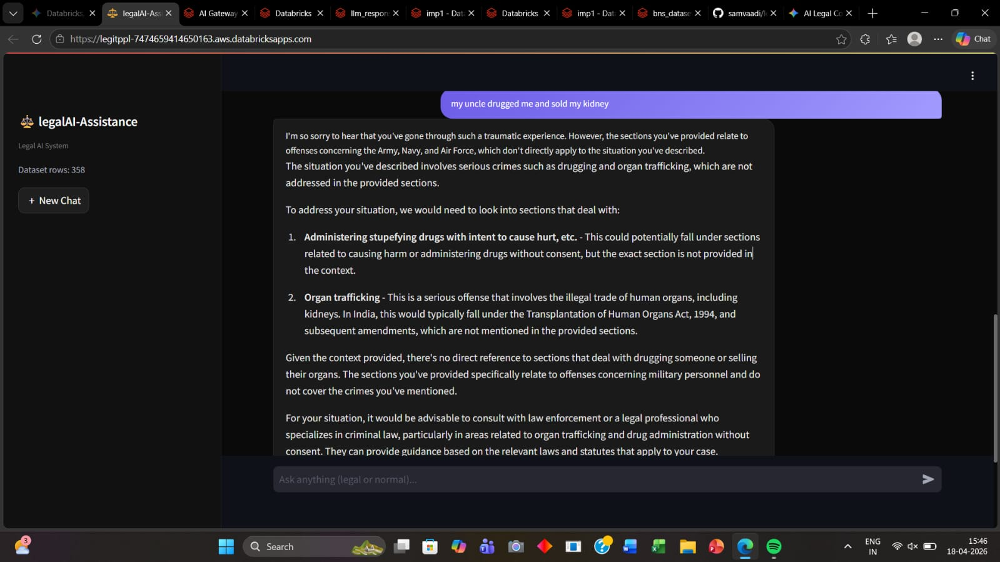

# ⚖️ LegalAI-Assistance-ClauseBreaker

**Nyaya-Sahayak** is an agentic RAG-based legal assistant designed to bridge the gap between complex Indian law and the common citizen. By leveraging the **Bharatiya Nyaya Sanhita (BNS)** dataset and state-of-the-art Indic embedding models, it provides context-aware, empathetic, and bilingual legal guidance.

---

## 🚀 Core Features

* **BNS-Specific RAG:** Uses a specialized retrieval pipeline to map user grievances directly to specific sections of the Bharatiya Nyaya Sanhita.
* **"Made in India" Embeddings:** Powered by `l3cube-pune/indic-sentence-bert-nli` for superior understanding of Indian legal context and linguistic nuances.
* **Bilingual Support:** Integrated with `IndicTransToolkit` to provide high-fidelity translations from English to Hindi.
* **Databricks Native:** Fully optimized for Databricks Unity Catalog and Model Serving (Llama-3/Mistral).
* **CPU Optimized:** High-performance vector search implemented using NumPy and Scikit-learn, making it cost-effective for deployment.

## 🧪 Test Cases & Capabilities

### Case 1: Bilingual Support (Hindi Input/Output)
The assistant can process queries in Hinglish/Hindi and provide detailed legal explanations in Hindi, ensuring accessibility for non-English speakers.

*Caption: Example of the assistant handling a bike theft query and providing legal context on defamation in Hindi.*

### Case 2: Out-of-Scope Intent Handling
The system is robust against irrelevant queries, maintaining its persona as a specialized legal AI and refusing to provide non-legal information.

*Caption: The model correctly identifying a recipe request as irrelevant to the BNS legal framework.*

### Case 3: Complex Legal Reasoning
Nyaya-Sahayak can analyze complex scenarios, such as self-defense, by pulling multiple relevant sections from the BNS to provide a nuanced perspective.

*Caption: Analyzing a self-defense scenario using Preliminary sections and definitions of "injury" from the BNS.*

### Case 4: Handling Severe Criminal Offenses
For serious crimes like organ trafficking and illegal drug administration, the model accurately identifies the gravity of the offense and recommends relevant legal statutes and professional legal consultation.

*Caption: The assistant identifying severe crimes (drugging and organ trafficking) and directing the user toward the appropriate legal frameworks and authorities.*

---

## 🏗️ Architecture

The system follows a Retrieval-Augmented Generation (RAG) workflow optimized for legal accuracy:

1.  **Ingestion:** BNS sections are chunked using `RecursiveCharacterTextSplitter` and embedded into a Delta Table within the Databricks Unity Catalog.
2.  **Retrieval:** User queries are vectorized on the fly. A cosine similarity search identifies the most relevant BNS provision from the vector table.
3.  **Augmentation:** The retrieved legal text is injected into a specialized prompt to provide the LLM with "ground truth" facts, eliminating hallucinations.
4.  **Generation:** A Databricks-hosted **Llama-3** model generates a simplified, empathetic explanation based on the retrieved law.
5.  **Translation:** The final response is translated into Hindi using `IndicTransToolkit` for broader accessibility across India.

---

## 🛠️ Technical Stack

### 🚀 Databricks Platform Technologies
* **Unity Catalog:** Centralized governance for managing the `bns_vector_table` and secure data access.
* **Delta Lake:** Storage layer for high-performance retrieval and versioning of legal embeddings.
* **Model Serving:** Hosts the **Llama-3** foundation model as a REST API endpoint for real-time inference.
* **Databricks Notebooks:** Primary environment for the RAG pipeline, ETL, and inference logic.
* **DBUtils:** Used for secure credential handling and parameterizing user inputs via UI widgets.

### 🤖 Models & Frameworks
* **LLM:** Llama-3-70B (via Databricks External Models)
* **Embeddings:** `l3cube-pune/indic-sentence-bert-nli` (Indic-focused MuRIL architecture)
* **Orchestration:** LangChain & Databricks-Langchain integration
* **Bilingual Toolkit:** `IndicTransToolkit` for high-fidelity English-to-Hindi translation
* **Vector Operations:** NumPy & Scikit-learn (optimized for CPU-based cosine similarity)

---

%pip install databricks-langchain langchain sentencepiece transformers torch IndicTransToolkit scikit-learn sentence-transformers

link to our website - https://legitppl-7474659414650163.aws.databricksapps.com/
